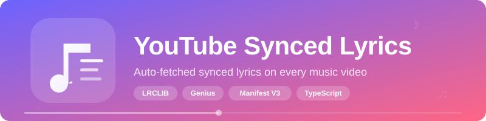

<p align="center">
  
</p>

<p align="center">
  <strong>A Chrome/Edge extension that automatically displays synced lyrics on YouTube music videos.</strong><br/>
  No clicks needed — just play a song and lyrics appear.
</p>

---

## How It Works

```
You open a YouTube video
        |
        v
Extension extracts song title & artist
        |
        v
   Search for lyrics
        |
        +---> LRCLIB synced lyrics (time-stamped, scrolls with the music)
        |         |
        |         x (not found)
        |         v
        +---> LRCLIB plain lyrics (full text, not synced)
        |         |
        |         x (not found)
        |         v
        +---> Genius lyrics (full text, scraped from genius.com)
        |         |
        |         x (not found)
        |         v
        +---> "Lyrics not found" + manual search option
```

The lyrics overlay appears at the bottom of the video player and smoothly moves up when YouTube controls are visible.

---

## Installation

### Chrome

1. Download or clone this repo
2. Run `npm install && npm run build`
3. Open `chrome://extensions/`
4. Enable **Developer mode** (toggle in top-right)
5. Click **Load unpacked**
6. Select the `dist/` folder inside this project

### Edge

1. Download or clone this repo
2. Run `npm install && npm run build`
3. Open `edge://extensions/`
4. Enable **Developer mode** (toggle in left sidebar)
5. Click **Load unpacked**
6. Select the `dist/` folder inside this project

### Updating

1. Pull the latest changes (or re-download)
2. Run `npm run build`
3. Go to your extensions page
4. Click the **refresh/reload** icon on the extension card

---

## What Works Well

| Type | Examples |
|------|---------|
| Official uploads | Artist channels, "Official Video", "Official Audio", "Lyric Video" |
| YouTube Music | Auto-generated videos from channels ending in "- Topic" |
| Vevo | All Vevo uploads |
| Popular tracks | Most songs released after 2010 with wide recognition |
| Multi-artist | Collabs like "Drake & 21 Savage" are normalized and searched |

## What May Not Have Lyrics

| Type | Why |
|------|-----|
| Obscure / indie tracks | Not indexed in LRCLIB or Genius yet |
| Remixes & mashups | Titles don't match any known track |
| Live concert recordings | Different metadata than studio versions |
| Non-English songs | Coverage varies by language and region |
| Very new releases | Lyrics databases may lag by a few days |

---

## When Lyrics Aren't Found

If the overlay shows **"Lyrics not found"**, you can search manually:

1. Click **"Wrong song?"** in the overlay controls
2. A search dialog opens — edit the artist and title
3. Search LRCLIB directly and pick the correct result
4. Lyrics load immediately and the match is **saved for next time**

> You can also **right-click** the music note button in the player controls to open the search dialog at any time.

---

## Controls

| Action | What it does |
|--------|-------------|
| **Click** the music note button | Toggle lyrics on/off |
| **Right-click** the music note button | Open manual search dialog |
| Click **"Wrong song?"** | Open manual search dialog |
| Click **&#9650;** / **&#9660;** offset buttons | Adjust sync timing by +/-0.5s |

> The sync offset is saved per song — adjust once and it remembers.

---

## Extension Popup

Click the extension icon in your toolbar to access settings:

| Setting | What it does |
|---------|-------------|
| **Enabled** | Turn the extension on or off globally |
| **Font size** | Adjust lyrics text size |
| **Position** | Bottom, middle, or top of the video |
| **Max duration** | Skip lyrics for videos longer than this (default: 15 min) |

---

## Skipped Automatically

The extension will **not** attempt to fetch lyrics for:

- Live streams
- Videos shorter than **30 seconds**
- Videos longer than the **max duration** setting (default 15 minutes)

---

## Development

```bash
npm install          # install dependencies
npm run dev          # dev server with HMR
npm run build        # production build -> dist/
npm test             # run tests (52 tests)
npm run test:watch   # tests in watch mode
```

## Project Structure

```
src/
  content/           # Content script (runs on YouTube)
    index.ts         # Orchestrator — auto-fetch pipeline
    youtube-dom.ts   # SPA navigation watcher + metadata extraction
    normalizer.ts    # Title parser (artist/song extraction)
    detector.ts      # Video classifier (music vs non-music)
    lrclib.ts        # LRCLIB API client
    lrc-parser.ts    # LRC timestamp parser
    sync-engine.ts   # RAF-based lyric sync with binary search
    cache.ts         # chrome.storage.local wrapper with TTL
    overlay/         # UI components
      overlay.ts     # Lyrics overlay (synced / static / not-found)
      player-button.ts
      search-dialog.tsx
  background/        # Service worker (Genius scraping)
  popup/             # Extension popup (Preact)
  shared/            # Types + settings
```

## Tech Stack

- **TypeScript** + **Vite** + **Manifest V3**
- **Preact** for popup UI and search dialog
- **LRCLIB** API for synced + plain lyrics
- **Genius** as plain lyrics fallback (scraped via background service worker)
- **chrome.storage.local** for caching, **chrome.storage.sync** for settings

---

## License

MIT
